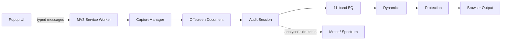

<div align="center">
  

# KopelaEQ

**Real-time parametric EQ and audio processing for Chromium tabs.**

[](../../releases/latest)


[](LICENSE)

Process the audio of the tab you choose with an 11-band parametric EQ, presets, dynamics, metering, spectrum analysis and output protection — directly in the browser.

**Maintained by Kopela.**

[Download](../../releases/latest) · [Changelog](CHANGELOG.md) · [Privacy](PRIVACY.md) · [Architecture](ARCHITECTURE.md) · [Security](SECURITY.md) · [License](LICENSE)
</div>

---

## Features

| | |
|---|---|
| **11-band parametric EQ** | Low Shelf + 9 Peak bands + High Shelf with frequency, gain and Q editing. |
| **Presets** | Bundled and user presets with save, update, duplicate, rename, delete, import and export. |
| **Dynamics** | Optional broadband / multiband processing with click-free true bypass. |
| **Protection** | Output peak protection with Light, Medium and Strong modes. |
| **Meter** | Pre/Post Protection Peak, RMS, Peak Hold and gain-reduction monitoring. |
| **Spectrum** | Native browser frequency analysis with Fast, Balanced and Smooth response modes. |
| **Per-tab sessions** | One serialized audio session per captured tab with safe Start/Stop lifecycle handling. |
| **Local processing** | KopelaEQ does not intentionally record or upload captured tab audio. |

## Audio path

```text
Tab audio
   ↓
Input gain
   ↓
Low Shelf → 9 × Peak → High Shelf
   ↓
Master gain
   ↓
Dynamics   ── true bypass when disabled
   ↓
Protection ── true bypass when disabled
   ↓
Browser output
```

Meter and Spectrum use analyser-only side chains and do not feed back into the audible signal path.

## Install

### From a release

1. Download `kopelaeq-1.22.0.zip` from **Releases**.
2. Extract the archive.
3. Open `chrome://extensions`.
4. Enable **Developer mode**.
5. Click **Load unpacked** and select the extracted folder.
6. Open a normal tab with audio, open KopelaEQ and enable **Audio On**.

> Restricted browser pages such as `chrome://` pages and the Chrome Web Store cannot be captured.

### From source

Requirements: Node.js 20+, TypeScript **5.8.3**, Python 3 and Chrome/Chromium for browser QA.

```bash
npm install
npm run typecheck
npm run build
npm run qa
```

The built extension is emitted to `extension/` as browser-native ESM.

## Architecture



The runtime source is strict TypeScript. Messages entering through `chrome.runtime.onMessage` are treated as `unknown`, runtime-validated, then handled through typed exhaustive switches.

See [ARCHITECTURE.md](ARCHITECTURE.md) for the complete design.

## Permissions

KopelaEQ intentionally keeps its permission surface small:

- `activeTab` — targets the tab on which the extension was invoked;
- `tabCapture` — obtains audio from that selected tab;
- `offscreen` — hosts the persistent Web Audio graph under Manifest V3;
- `storage` — stores settings, presets and popup layout.

There are **no host permissions, content scripts, page injection, analytics, advertising SDKs or developer-controlled network requests** in the extension.

## Audio compatibility and QA

The public 1.22.0 baseline is protected by automated regression tests, including:

- exact bundled preset fixtures;
- browser-native EQ golden responses at **44.1 kHz and 48 kHz**;
- analyser side-chain transparency;
- click-free bypass transitions;
- capture lifecycle and multi-tab handling;
- **100 sequential Start/Stop cycles**;
- deterministic release ZIP verification.

The accepted EQ response matches the frozen golden reference with **0 dB maximum difference** in the release tests.

See [QA_REPORT.md](QA_REPORT.md) and [RELEASE_CHECKLIST.md](RELEASE_CHECKLIST.md).

## Development

```text
src/
├── audio/        AudioSession, BypassGate, native EQ response
├── background/   CaptureManager + MV3 service worker
├── offscreen/    persistent audio runtime
├── popup/        EQ editor and popup controllers
├── shared/       state, presets, messages and constants
└── types/        minimal Chrome API declarations
```

Before submitting a change:

```bash
npm run typecheck
npm run qa
```

For release packaging:

```bash
npm run release
```

Release archives are deterministic and verified with SHA-256.

## Privacy

Captured tab audio is processed locally in memory with Web Audio. KopelaEQ does not intentionally record, sell, share or upload that audio. Settings and presets are stored through Chrome storage.

Read the full [Privacy Policy](PRIVACY.md).

## Contributing

See [CONTRIBUTING.md](CONTRIBUTING.md). Audio topology or tuning changes must be isolated from unrelated UI/build refactors and must pass the golden-response tests.

## License

KopelaEQ is released under the [MIT License](LICENSE).

Copyright (c) 2026 Kopela.
